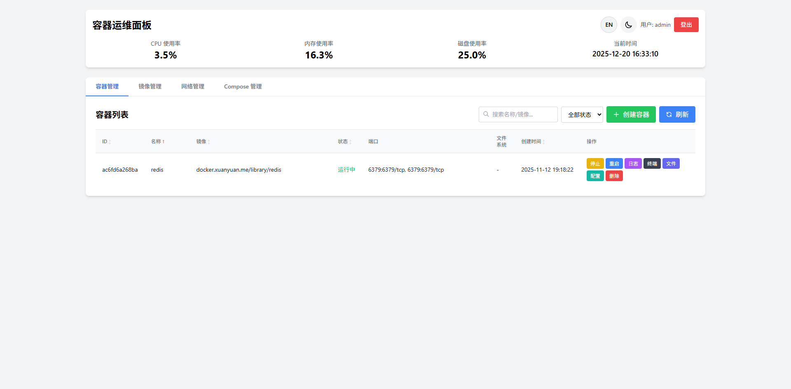
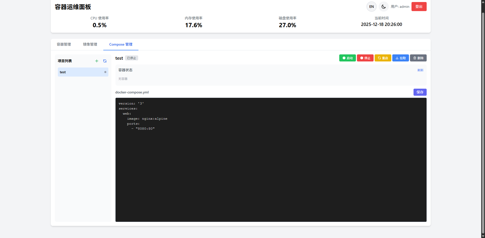
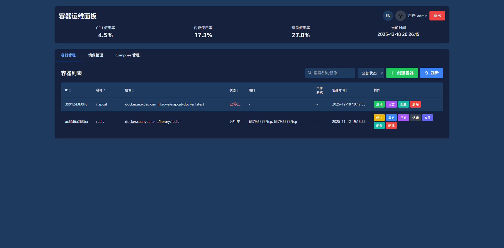

# Rabbit Panel ｜ 极致轻量容器运维面板

一个极致轻量的 Docker 运维面板，面向 4GB 内存设备，支持 ARM64 / armv7l / x86_64，多节点集中管理，开箱即用。

## 特性

- 🚀 **极致轻量**：运行时内存 ≤ 30MB，二进制 ≤ 10MB
- 🐳 **容器管理**：启动/停止/重启/删除，实时日志（SSE）
- 📦 **镜像管理**：查看与删除镜像
- 🧩 **Compose 管理**：在线创建/编辑 `docker-compose.yml`，一键 Up/Down/Restart/Pull/Logs
- 📊 **系统监控**：CPU/内存/磁盘实时监控（5 秒刷新）
- 🌐 **响应式设计**：PC/平板/手机良好体验
- 🔧 **零依赖**：单二进制，内置前端，无数据库，无额外安装
- 🎯 **多节点管理**：Master/Worker 统一管理多台服务器
- 🔒 **安全认证**：JWT 登录认证 + HMAC 节点认证

## 预览







## 环境要求

- Docker 20.10+（已安装并运行，建议将用户加入 `docker` 组）
- Linux（Armbian / Ubuntu / Debian）
- 4GB+ 内存设备
- Go 1.22+（仅用于本地编译）

## 快速开始

### 1. Docker 部署（推荐）

**方式一：docker run 快速启动**

```bash
docker run -d \
  --name rabbit-panel \
  --restart unless-stopped \
  -p 9999:9999 \
  -v /var/run/docker.sock:/var/run/docker.sock \
  -v /root/rabbit-panel/compose_projects:/app/compose_projects \
  -v /root/rabbit-panel/data:/app/data \
  -e TZ=Asia/Shanghai \
  rabbit-panel:latest
```

**方式二：docker-compose 部署**

```bash
# 克隆代码
git clone https://github.com/reisen7/rabbit-panel.git
cd rabbit-panel

# 一键启动
docker compose -f docker-compose.deploy.yml up -d

# 查看日志
docker logs -f rabbit-panel

# 停止
docker compose -f docker-compose.deploy.yml down
```

> ⚠️ 生产环境请修改 `JWT_SECRET` 和 `NODE_SECRET`

### 2. 源码编译部署

```bash
# 安装 Docker (如果未安装)
curl -fsSL https://get.docker.com -o get-docker.sh
sudo sh get-docker.sh
sudo usermod -aG docker $USER
newgrp docker

# 克隆代码
git clone https://github.com/reisen7/rabbit-panel.git
cd rabbit-panel

# 编译
chmod +x rabbit.sh
./rabbit.sh build

# 启动
./rabbit.sh start

# 访问 http://localhost:9999
```

> 交叉编译：`./rabbit.sh build arm64`（支持 amd64 | arm64 | armv7 | all）

### 3. 运行管理

推荐使用集成脚本 `rabbit.sh` 管理启动/停止/重启/状态/编译：

```bash
# 授权脚本
chmod +x rabbit.sh

# 编译并启动
./rabbit.sh build
./rabbit.sh start

# 查看状态与日志
./rabbit.sh status
./rabbit.sh log

# 停止或重启
./rabbit.sh stop
./rabbit.sh restart
```

也可直接运行二进制（默认端口 9999）：
> 下载地址：
> https://github.com/reisen7/rabbit-panel/releases
```bash
# 运行面板 (默认端口 9999)
./rabbit-panel-linux-arm64

# 或指定端口
PORT=9090 ./rabbit-panel-linux-arm64

# 或指定监听地址和端口
HOST=0.0.0.0 PORT=9999 ./rabbit-panel-linux-arm64
```

### 4. 访问面板

- **本地访问**: `http://localhost:9999`
- **外网访问**: `http://<服务器IP>:9999`
- **默认账户**: `admin` / `admin`

> 注意：首次登录必须修改密码。默认监听 `0.0.0.0:9999`，可外网访问。

## 功能说明

### 容器管理

- **列表展示**: 显示容器 ID、名称、镜像、状态、端口映射、内存占用、创建时间
- **操作功能**: 启动、停止、重启、删除、查看日志（实时流式输出）
- **自动刷新**: 容器列表每 5 秒自动刷新

### 镜像管理

- **列表展示**: 显示镜像 ID、名称、标签、大小、创建时间
- **操作功能**: 删除镜像（如果被容器使用会提示先删除容器）

### 系统监控

- **实时监控**: CPU 使用率、内存使用率、磁盘使用率
- **自动刷新**: 每 5 秒自动刷新
- **时间显示**: 显示服务器当前时间

## 多节点管理

Rabbit Panel 支持多节点容器管理，类似 Kubernetes 但更轻量化。

### Docker 部署（推荐）

**Master 节点：**
```bash
# 在 Master 服务器上
docker compose -f docker-compose.master.yml up -d
```

**Worker 节点：**
```bash
# 1. 修改 docker-compose.worker.yml 中的配置：
#    - MASTER_URL: Master 节点地址
#    - NODE_NAME: 当前节点名称

# 2. 在 Worker 服务器上启动
docker compose -f docker-compose.worker.yml up -d
```

> ⚠️ Master 和 Worker 的 `JWT_SECRET` 和 `NODE_SECRET` 必须相同

### 二进制部署

**Master 节点：**
```bash
MODE=master PORT=9999 ./rabbit-panel-linux-arm64
```

**Worker 节点：**
```bash
MASTER_URL=http://master-ip:9999 \
NODE_NAME=worker-1 \
MODE=worker \
PORT=10001 \
./rabbit-panel-linux-arm64
```

### 多节点功能

- ✅ **统一管理**: 在 Master 节点查看和管理所有 Worker 节点的容器
- ✅ **智能调度**: 自动选择最佳节点部署容器
- ✅ **节点监控**: 实时监控所有节点的资源使用情况
- ✅ **跨节点操作**: 在 Master 节点操作任意 Worker 节点的容器

详细文档请参考：多节点管理将在后续版本完善。

## Compose 管理（在线）

- 在前端“Compose 管理”页新建项目（存储于 `compose_projects/<name>/docker-compose.yml`）
- 支持在线编辑（深色编辑器、Tab 插入空格），保存文件
- 支持执行：`up -d`、`down`、`restart`、`pull`、`logs`，输出结果在面板展示
- 切换到 Compose 标签页会自动刷新项目列表

> 需要本机已安装 `docker compose`（你已安装：`docker compose version` 返回成功）。


## 配置与安全

### 环境变量配置

- `MODE`：节点模式，`master` 或 `worker`，默认 `master`
- `PORT`：服务端口，默认 `9999`
- `HOST`：绑定地址，默认 `0.0.0.0`
- `JWT_SECRET`：用户认证密钥（生产环境必须设置）
- `NODE_SECRET`：节点通信密钥（生产环境必须设置）

示例：

```bash
MODE=master PORT=9999 HOST=0.0.0.0 \
JWT_SECRET=change-me NODE_SECRET=change-me \
./rabbit-panel-linux-arm64
```

### 用户认证

所有 Web UI 访问的 API 都需要用户登录认证：

- **默认账户**: `admin` / `admin`
- **首次登录**: 必须修改密码
- **密码要求**: 至少 8 位，包含大小写字母、数字和特殊字符

### 节点间认证

Master 和 Worker 节点之间的通信使用 HMAC-SHA256 认证机制。

**生产环境必须设置节点密钥**:
```bash
NODE_SECRET=your-secret-key-here ./rabbit-panel-linux-arm64
```

## 项目结构

```
rabbit-panel/
├── main.go              # 后端主文件
├── auth.go              # 认证模块
├── node.go              # 节点管理模块
├── scheduler.go         # 容器调度模块
├── compose.go           # Compose 在线管理 API
├── static/
│   ├── index.html       # 前端主页面
│   ├── css/
│   │   └── style.css    # 样式文件
│   └── js/
│       ├── utils.js     # 工具函数（防抖、Toast、分页器、主题）
│       ├── auth.js      # 认证模块
│       ├── containers.js # 容器管理
│       ├── images.js    # 镜像管理
│       ├── logs.js      # 日志模块
│       ├── compose.js   # Compose 管理
│       └── app.js       # 主应用入口
├── rabbit.sh            # 一键管理脚本
├── .air.toml            # 开发热重载配置
├── go.mod / go.sum      # Go 依赖
└── README.md            # 说明文档
```

## 许可证

MIT License

## 贡献

欢迎提交 Issue 和 Pull Request！

## 更新日志

### v1.3.1 (2025-12-20)

**新功能**
- 🌐 新增网络管理功能：
  - 查看网络列表（名称、驱动、范围、IPAM、容器数）
  - 创建自定义网络（支持 bridge/overlay/macvlan/host/none 驱动）
  - 删除网络（系统网络受保护）
  - 查看网络详情和连接的容器
- 🏗️ 新增镜像构建功能：
  - 支持在线编辑 Dockerfile
  - 支持上传 Dockerfile 文件
  - 实时显示构建日志（SSE 流式输出）
- 📤 Compose 编辑器支持上传 docker-compose.yml 文件
- 🐳 新增 Docker 部署支持：
  - 提供 Dockerfile 和 docker-compose.yml
  - 支持 Master/Worker 多节点 Docker 部署

**优化改进**
- 📱 网络管理移动端适配，响应式隐藏部分列
- 📝 主要功能添加英文日志输出，便于排查问题
- 🔧 镜像删除添加友好错误提示（被使用、有子镜像依赖等）
- 🎨 修复网络详情 ID 过长导致布局错乱

### v1.3.0 (2025-12-18)

**新功能**
- 🌐 新增国际化支持（中文/英文切换），自动检测浏览器语言
- 💻 新增容器终端功能，支持在线执行命令
- 📁 新增容器文件管理功能：
  - 浏览容器内目录结构
  - 创建/删除目录和文件
  - 上传/下载文件（限制 10MB）
  - 在线编辑文本文件
- ⚙️ 新增容器配置管理功能：
  - 查看完整容器配置（基本信息、网络、存储、环境变量、资源限制、高级配置）
  - 支持热更新：内存限制、CPU 限制、重启策略
  - 支持容器重命名
  - 支持重建容器（修改端口、数据卷、环境变量等）

**界面优化**
- 🎨 优化深色模式下的文字可读性
- 🔄 重建容器添加加载动画和确认弹窗
- 📝 重建容器镜像地址和标签分离，方便版本升级

**Bug 修复**
- 修复 Docker API 版本兼容性问题（支持 API 1.44+）
- 修复容器内存更新时 MemorySwap 限制错误

### v1.2.0 (2025-12-17)

**前端优化**
- 🎨 新增深色模式支持，自动保存主题偏好
- 📱 全面优化移动端适配，Compose 管理支持响应式布局
- 🔍 容器/镜像列表支持表格排序和分页
- 🔎 日志搜索支持关键词高亮显示
- ⚡ 搜索输入添加防抖优化，减少不必要的请求

**功能增强**
- 🐳 新增「创建容器」功能，支持通过表单配置：
  - 镜像名称、容器名称
  - 端口映射（支持多个）
  - 环境变量（支持多个）
  - 数据卷挂载（支持多个）
  - 重启策略、网络模式
  - 实时命令预览
- 📦 Compose 管理界面重构：
  - 左右分栏布局（桌面端）
  - 项目列表显示容器运行状态
  - 支持快捷操作（启动/停止/重启）
  - 容器状态实时显示
  - 支持删除项目
- 🔄 容器操作后自动刷新列表

**代码重构**
- 前端代码拆分为独立模块 (css/style.css, js/*.js)
- 新增 DOM 缓存和分页器工具类

**Bug 修复**
- 修复删除容器后列表不刷新的问题
- 修复后端缓存导致状态更新延迟的问题

### v1.1.0 (2025-12-16)

- 支持单文件部署（静态资源嵌入二进制）
- 添加用户登录认证
- 添加节点间通信认证 (HMAC-SHA256)
- 改进多节点管理功能
- 优化性能和内存占用

### v1.0.0 (2025-11-16)

- 初始版本发布
- 支持容器管理 (启动/停止/重启/删除/日志)
- 支持镜像管理 (列表/删除)
- 支持系统监控 (CPU/内存/磁盘)
- 支持多架构编译 (ARM64/armv7l/x86_64)
- 支持多节点管理 (Master/Worker 模式)
